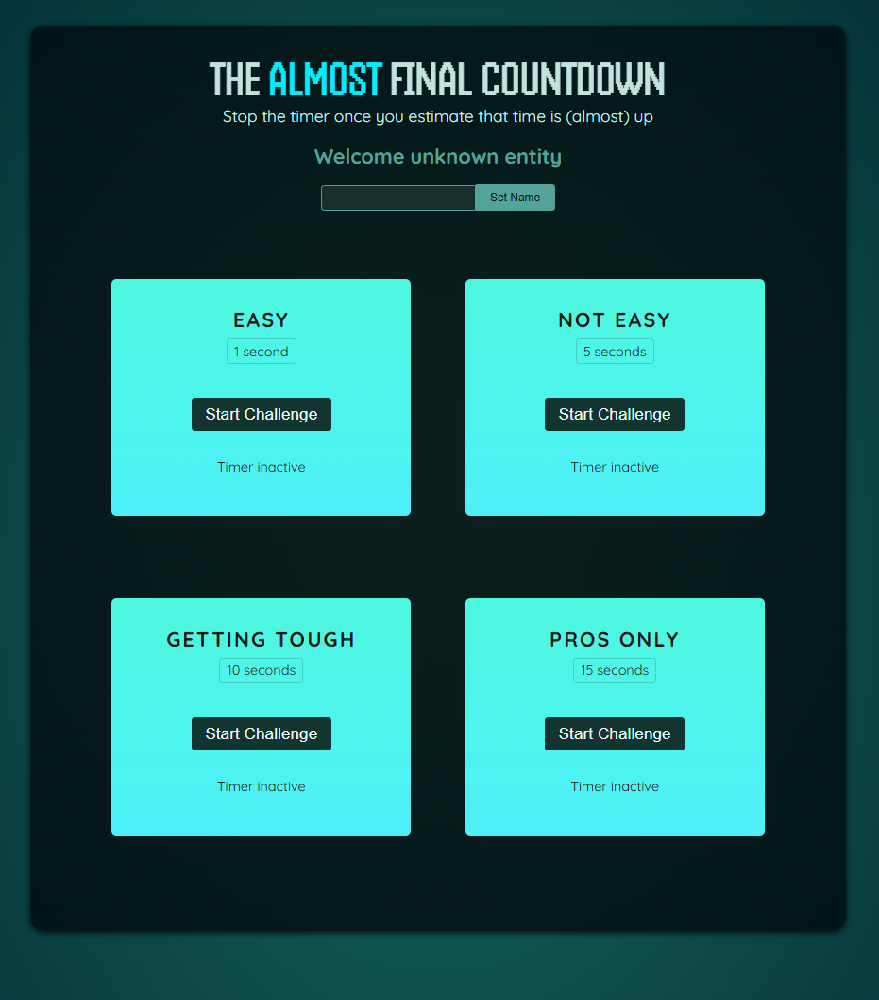

# React Timer Challenge

This is a React project designed to practice working with refs and portals. 
The game challenges users to stop a timer as close as possible to the target time. 
It demonstrates state management, event handling, refs for managing timers, and portals 
for rendering modals efficiently. This project provides hands-on experience with useRef, 
useImperativeHandle, and React Portals. 
<br><br>


## 🚀 Getting Started

### **Prerequisites**
Make sure you have the following installed before running the project:
- **Node.js** (Download from [nodejs.org](https://nodejs.org/))
- **npm** or **yarn** (Comes with Node.js)
<br>

### **Installation**
1. Clone this repository:
   ```sh
   git clone https://github.com/nathenpriyonggo/react-refs/
   ```
2. Navigate to the directory
   ```sh
   cd react-refs
   ```
3. Install dependencies:
   ```sh
   npm install
   ```
4. Start the development server:
   ```sh
   npm run dev
   ```
5. Open ```http://localhost:5173/``` in your browser.
<br>

## 🛠️ Built With
- **React** - A JavaScript library for building user interfaces
- **Vite** - A fast build tool for modern web projects
<br>

## ⌛ Features
- **Multiple Timer Challenges** - Users can choose different difficulty levels.
- **Dynamic Timer** - Displays real-time countdown updates.
- **Score Calculation** - Determines how close the user was to stopping at the target time.
- **Result Modal** - Displays whether the user won or lost.
- **State & Ref Management** - Uses useState, useRef, and useImperativeHandle for handling timers and dialogs efficiently. <br>
<br>


## 🖥️ Preview
<p align="center"></p>
<br>

## 📜 License
This project is open-source. Feel free to modify and expand upon it!
<br><br>


---

✨ Happy coding! 🚀
